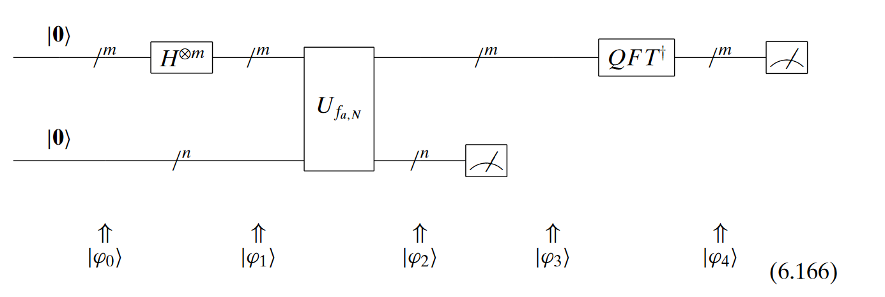

# QFE and Shor's Algorithm

## Quantum Phase Estimation
There are some special vectors, called *eigenvectors*, where applying the $X$ gate results in the exact same vector, multiplied by a by a number called an *eigenvector*. For example, $\ket{+}$ is an eigenvector of the $X$ gate.
$$
X\ket{+} = \begin{pmatrix} 0 & 1 \\1 &0 \end{pmatrix}  \begin{pmatrix} \frac{1}{\sqrt{2}} \\ \frac{1}{\sqrt{2}} \end{pmatrix} = \begin{pmatrix} \frac{1}{\sqrt{2}} \\ \frac{1}{\sqrt{2}} \end{pmatrix} = \ket{+}
$$

The goal of phase estiamtion is:

Given a unitary matrix $U$ and an eigenvector $\ket{\psi}$, find $\phi$ such that $U\ket{\psi} = e^{i\phi}\ket{\psi}$

**Represnting the phase**\
From binary number to decimal number:
$$
\frac{a_1}{2} + \frac{a_2}{4} + \dots + \frac{a_n}{2^n} = 0.a_1a_2\dots a_n
$$

## Shor's algorithm

**Period Finding**
periodic function
$$
f(x) = a^x mod N
$$
where a and N are positve integers, a is less than N, and they have no common factors. The period, or order($r$), is the **Smallest (non zero)** integer such that:
$$
a^r mod N = 1
$$
Shor's solution was to use quantum phase estimation on the unitary operator:
$$
U|y \rangle \equiv |ay \ mod \ N \rangle
$$

**Shor's Algorithm in quantum circuit**

**Measurement outcome**
* Upper register **m**: outputs binary number to find r

* Lower register: **n**: outputs outcome of $f_{a,N}$

m: outcome  M: number of  qubits in upper register
$$
\frac{k}{r} = \frac{m}{2^M}
$$
Quantum states during the circuit
$$
|\psi_0 \rangle = |0_m , 0_n \rangle
$$

$$
| \psi_1 \rangle = \frac{\sum_{x \in \{0,1\}^m} |x, 0_n \rangle}{\sqrt{2^m}}
$$
$$
|\psi_2 \rangle = \frac{\sum_{x \in \{0,1\}^{m}} | x, a^x \text{Mod N} \rangle}{\sqrt{2^m}}
$$
·
$$
|\psi_3\rangle = \frac{\sum_{j=0}^{2^m/r - 1} |t_0 + jr, a^{\bar{x}} \, \text{Mod} \, N \rangle}{\left\lfloor \frac{2^m}{r} \right\rfloor}

$$

**Example**
For N = 15, we will have n = 4 and m = 8. For a = 13, the state $|\psi2\rangle$ will be
$$
\frac{|0, 1\rangle + |1, 13\rangle + |2, 4\rangle + |3, 7\rangle + |4, 1\rangle + \dots + |254, 4\rangle + |255, 7\rangle}{\sqrt{256}}
$$

After measurement of the bottom qubits, 7 is found
$$
\frac{|3, 7\rangle + |7, 7\rangle + |11, 7\rangle + |15, 7\rangle + \dots + |251, 7\rangle + |255, 7\rangle}{\left[ \frac{256}{4} \right]}
\
$$