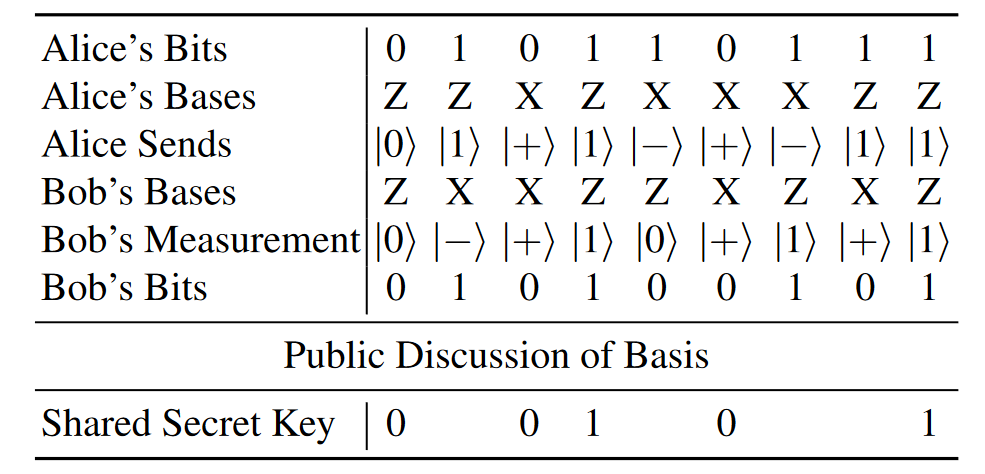
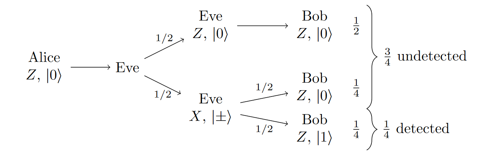
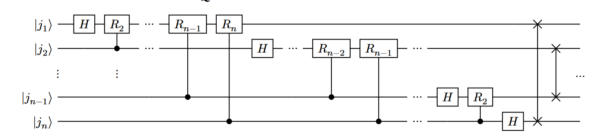

# QKD and QFT

## Quamtum Key Distribution: BB84
In BB84, Alice begins with a bunch of **random bits**, and for each bit, she **randomly chooses** either the Z-basis $\{\ket{0},\ket{1}\}$ or the X-basis $\{ \ket{+}, \ket{-} \}$

Bob receives the qubits, and he **randomly** measures each one in either the Z-basis or X-basis. If the basis he picked was the **same** as Alice's, then he will get the same result. If he picked the opposite basis, however he will get each possible result with **50%** possibility.

Alice and Bob now publicly announce what basis they used for measurement. **If they used the same basis, then they know their measurement outcome should agree** and they have a shared secret bit. If they used different bases, they will discard these bits.

**Prevent Eavesdropping**

To ensure Eve did not measure the qubits along the way, Alice and Bob can reveal a fraction of their shared qubits.\
Generating 306 bits using BB84, revealing 50 bits to ensure no evasdropper.

$$
\text{Probability Alice and Bob detect Eve} = 1 - (\frac{3}{4})^n
$$
Thus if Alice and Bob share 50 bits of their shared secre key, the probability that they detect Eve is $1- (\frac{3}{4})^50 = 0.99999943$, which is very close to certainty.

## Quantum Fourier Transform
$|\psi\rangle$: A normalized quantum state:
$$
\left| \psi \right\rangle = 
\begin{pmatrix}
a_0 \\
a_1 \\
a_2 \\
\vdots \\
a_{N-1}
\end{pmatrix}
= a_0 \left| 0 \right\rangle + \cdots + a_{N-1} \left| N-1 \right\rangle
$$
Applying the QFT yields another normalized quantum state:

$$
\left| \phi \right\rangle =
\begin{pmatrix}
\phi_0 \\
\phi_1 \\
\phi_2 \\
\vdots \\
\phi_{N-1}
\end{pmatrix}
= 
\phi_0 |0\rangle + \dots + \phi_{N-1}|N-1\rangle
$$
We call $|\phi\rangle$ the quantum Fourier fransform of $|\psi\rangle$. The equat   ion:

**Generic QFT circuit**
$$
\left| j \right\rangle \longrightarrow \frac{1}{\sqrt{N}} \sum_{k=0}^{N-1} e^{\frac{2\pi i jk}{N}} \left| k \right\rangle
$$

Where $R_k$:
$$
R_k = \begin{bmatrix}
1 & 0 \\
0 & e^{2\pi \frac{i}{2^k}}
\end{bmatrix}
$$

To invert the QFT, we must run the circuit in reverse, with the inverse of each gate in place to achieve the transform

**Inverse Quantum Fourier Transform**\
The *inverse quantum Fourier transform (IQFT)* undoes the QFT.
$$
\frac{1}{\sqrt{N}} \sum_{k=0}^{N-1} e^{2\pi i j \frac{ik}{N}} \left| k \right\rangle \longrightarrow \left| j \right\rangle
$$

Since quantum gates are unitary, the inverses are their conjugate transpose.
$\text{SWAP}^\dagger = \text{SWAP}$, $H^\dagger = H$ and $R_k^\dagger$ is a rotation about the z-axis of the Bloch sphere by $-\frac{\pi}{2^k}$ radians.\
The $R_k^\dagger$:
$$
R_k^\dagger = \begin{bmatrix}
1 & 0 \\
0 & e^{-2\pi \frac{i}{2^k}}
\end{bmatrix}
$$