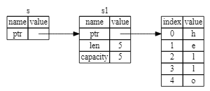

所有权是rust最独特的特性，可以让rust无需gc(garbage collecter)就能保证内存安全。
### Stack vs Heap
Stack 和 Heap 都是可用的内存，但是结构差别很大

## 所有权规则
* 每个值都有一个变量，这个变量是这个值改的所有者
* 每个值同时只能有一个所有者
* 当所有者离开作用域(scope), 这个值就会被删除。

## 变量作用域
Scope 就是程序中一个项目的范围

## String 类型
* String 比那些基础类型更复杂，因为它是一个复合类型
* 字符串字面值：不可变，硬编码到程序中

我们可以使用from函数从字符串字面值创建出String 类型
```
let s = String::from("hello");
```
"::" 表示from是String类型下的一个函数

```rust
let mut s = String::from("Hello");
s.push_str(", world!");
println!("{}", s);
```

## 内存与分配
* 字符串字面值，在编译的时候就知道内容了，其文本内容可以被硬编码到最终的可执行文件中，这也是为什么字符串字面值是快速的原因。（不可变性）
* String 类型，为了支持其可变性，需要在heap上分配内存来保存编译文本时的未知的文本内容：
    * 操作系统必须在运行时来请求内存
        * 这步通过调用 String::from 完成
    * 当用完String后，需要使用某种方式将内存返回给操作系统
        * 这步，在拥有GC的语言中，由GC完成
        * 没有GC，就需要我们去识别何时不再需要这些内存并调用代码来释放它。
            * 如果忘了，那就浪费内存
            * 如果过早释放，变量就会非法
            * 如果重复释放，也会非法
Rust 采用了不同的方式；对于某个值来说，当拥有它的变量走出作用范围时，内存会立即自动地交还给操作系统。
这里是自动调用了drop函数。
* 当变量离开作用域时, Rust 会自动调用drop函数, 并将变量使用的heap内存释放。
## 变量与数据交互的方式：移动(Move)
多个变量可以与同一个数据使用一种独特的方式来交互
```rust
let x =5;
let y = x;
```
整数是已知固定大小件简单的值，这两个5被压到了stack中

string类型，是一个三部分的值：指向存储在heap中的内容的指针，长度，容量


```rust
let s1 = String::from("Hello");
let s2 = s1;
```
当把s1赋给s2，String 的数据被复制了一份；
* 在stack上复制了一份指针，长度，容量
* 并没有复制指针指向的heap上的数据


当s1,s2离开作用域时，它们都会尝试释放同一块内存。这会导致一个双重释放的错误，这是非常危险的。
double free bug！
为了保证内存安全：
- Rust 没有尝试复制被分配的内存
- Rust 让s1失效。
  - 当s1离开作用域时，rust不需要释放任何东西。

这里会报错，因为s1已经失效了，rust不允许使用失效的变量。
```rust
let s1 = String::from("Hello");
let s2 = s1;
println!("{}, world!", s1);
```
Rust 让s1失效的操作叫做：移动(move)。
Rust不会自动创建数据的深拷贝
修复方法：
```rust
let s1 = String::from("Hello");
let s2 = s1.clone();
println!("{},{}", s1, s2);
```
对heap上的数据进行深度拷贝（消耗资源）

### Stack上的数据：复制
Copy trait, 可以用于像整数这样可以完全存放在stack上的类型。  
如果一个类型实现了Copy这个trait, 那么旧的变量在赋值以后仍然可用。  
如何一个类型或者该类型的一部分实现了Drop trait 那么Rust 就不允许实现Copy trait。

### 一些拥有Copy trait的类型
任何单标量的组合类型都可以是Copy的。  
如果需要分配内存或者某种资源的都不是Copy的。
* 一些拥有Copy trait 的类型：
    * 所有的整数类型, eg: u32
    * bool
    * char
    * 所有的浮点数类型, eg: f64
    * Tuple (元组), 如果其元素类型都是Copy的，那么该元组也是Copy的。
        * (i32, i32) 是。
        * (i32, String) 不是。

## 所有权和函数
```rust
fn main() {
    let s = String::from("hello world");
    take_ownership(s);
    // 从这以后，s不再有效
    
    let x = 5;

    make_copy(x); 

    // 从这以后，x还可以继续使用。
    println!("{}", x);

}

fn take_ownership(some_string: String){
    println!("{}", some_string);
}

fn make_copy(some_integer: i32){
    println!("{}", some_integer);
}

```

## 返回值与作用域
函数在返回值的过程中也会同样发生所有权的转移
一个变量的所有权总是遵循相同的模式：
* 将值赋给另一个变量时会发生移动
* 当一个包含heap的数据的变量离开作用域时, 它的值会被drop函数清理,除非数据的所有权移动到另外一个变量上了

**如何让函数使用某个值,但不获得其所有权？**

## 引用与借用

```rust
fn main() {
    let s1 = String::from("hello");
    let len = calculate_length(&s1);
    println!("The length of '{}' is {}.", s1, len);

}

fn calculate_length(s: &String) -> usize {
    s.len()
}

```

这里参数的类型是&String, 称为引用(reference)。  

  

这里s就是s1的引用。

我们把引用作为函数参数叫做借用(borrowing)。
和变量一样,引用默认是不可变的。  
## 可变引用
```rust
fn main() {
    let mut s1 = String::from("hello");
    let len = calculate_length(&mut s1);
    println!("The length of '{}' is {}.", s1, len);

}

fn calculate_length(s: &mut String) -> usize {
    s.push_str(", world!");
    s.len()
}
```
可变引用有一个重要的限制：在特定作用域内,对于某一块数据,只能有**一个**可变的引用。
这里就会报错
```rust
fn main() {
    let mut s = String::from("hello");
    let s1 = &mut s;
    let s2 = &mut s;
    println!("{}, {}", s1, s2);

}
```
这样的好处是可以在编译的时候防止数据竞争  
* 以下三种行为会发生数据竞争：
    * 两个或多个指针同时访问同一个数据
    * 至少有一个指针被用来写入数据
    * 没有使用任何机制来同步对数据的访问
* 可以通过创建新的作用域来允许非同时地创建多个可变引用
```rust
fn main() {
    let mut s = String::from("hello");
    {
        let s1 = &mut s;
    }

    let s2 = &mut s;

}
```
引用的规则：
* 在任意给定的时刻，只能满足下列条件之一：
    * 一个可变引用
    * 任意数量不可变的引用
* 引用必须一直有效