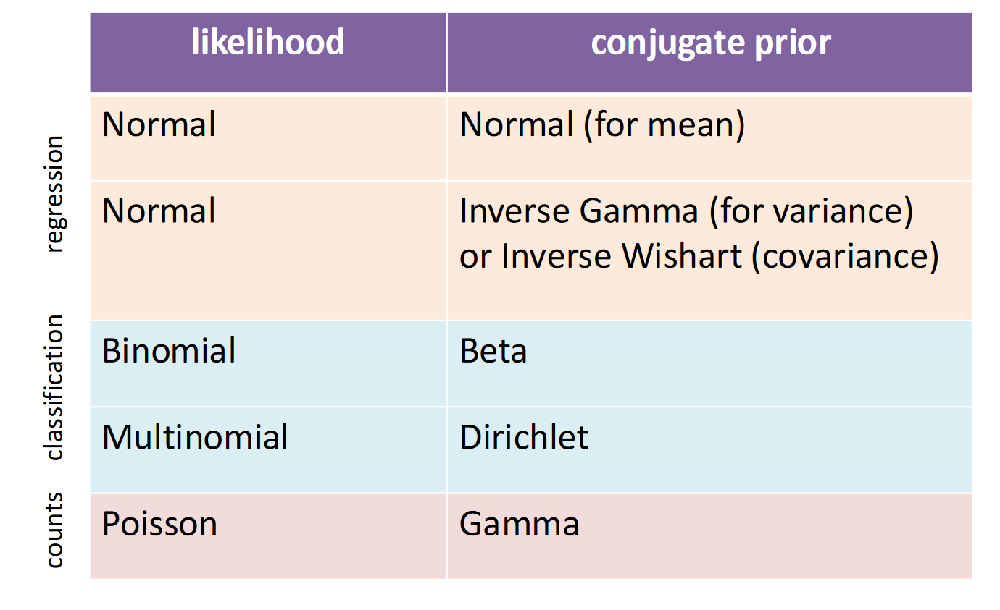

## The Bayesian view
**Retain and model all unknowns (e.g., uncertainty over parameters) and use this information when making inferences.**

贝叶斯学派和频率学派在统计推断方面有一些根本的区别
1. 参数的本质
  * 频率学派: 认为参数是固定但未知的常数。
  * 贝叶斯学派: 将参数视为随机变量，有其自身的概率分布。

2. 概率的定义:
  * 频率学派: 概率被定义为长期频率。
  * 贝叶斯学派: 概率表示信念的程度或合理期望。

3. 推断方法:
  * 频率学派: 基于假设的重复采样。
  * 贝叶斯学派: 使用信度区间（也称后验区间）。

4. 小样本推断:
  * 频率学派: 在小样本情况下可能表现不佳。
  * 贝叶斯学派: 可以更好地处理小样本情况，特别是当有合理的先验时。

5.结果的解释:
* 频率学派: "如果我们重复这个实验很多次，95%的置信区间会包含真实参数。"
* 贝叶斯学派: "基于当前数据和先验信息，真实参数有95%的概率落在这个区间内。"

recap: 在频率统计中认为数据是服从某种概率分布的，我们需要找到某个分布的参数。而且随着样本的批次越来越多， 估计参数会趋近于实际参数。在贝叶斯统计中认为**参数**也是服从某些分布的。在没有任何数据的支持下的分布被称为**先验分布**。贝叶斯用数据的**似然函数**来更新先验分布，从而得到参数的**后验分布**。

**So, What is Likelihood? That is a question confues me for a very loooooong time!**
I found a set of cool explanations!\
[What is the difference between "likelihood" and "probability"?](https://stats.stackexchange.com/questions/2641/what-is-the-difference-between-likelihood-and-probability)

似然函数告诉我们，在给定的数据下，模型的不同参数值有多大可能性是正确的。高似然值表示数据强烈支持某个参数值，低似然值则表示数据不太支持该参数值。\
Likelihood is a measure of the extent to which a sample provides support for particular values of a parameter in a parametric model.

**Could we reason over all parameters that are consistent with the data?**

首先，贝叶斯观点提出了一个重要的问题：我们能否考虑所有与数据一致的参数?
Consistent: 与数据一致的参数 指的是那些在模型中能够以非零概率生成我们观测到的数据的参数值。

* weights with a better fit to the training data should be more probable than others.
* make predictions with all these weights, scaled by their probability.

### Advantage of Bayesian
* Many **reasonable** solutions to objective\
多种合理的解决方案

More robust predictions
* less sensitive to overfitting, particularly with small training sets\
防止过拟合，特别是很小的数据集下

* Can give rise to more expressive model class (Bayesian logistic regression becomes **non-linear**!)

### Mini summary
* Frequentist’s central preference of point estimates don’t capture uncertainty
* Bayesian view is to quantify belief in prior, update it to posterior using observations\
贝叶斯观点是量化对先验的信念，并通过观测更新为后验信念。

### Bayesian Linear Regression
Probabilistic formulation of linear regression:  
$$y\sim \text{Normal}(\mathbf{x}'\mathbf{w}, \sigma^2)$$
Prior distribution of weight w:  
$$\mathbf{w} \sim \text{Normal}(\mathbf{0}, \gamma^2\mathbf{I}_D)$$
Bayesian rule:
$$p(\mathbf{w}|\mathbf{X}, \mathbf{y}) = \frac{p(\mathbf{y}|\mathbf{X}, \mathbf{w})p(\mathbf{w})}{p(\mathbf{y}|\mathbf{X})}$$
Calculate the posterior distribution of weight w. 用于计算权重w的后验概率

### Bayesian Linear Regression (cont.)
**conjugate prior**: when product of likelihood x prior results in the same distribution as the prior\
共轭先验：当似然函数与先验的乘积结果与先验属于相同分布时。

#### **Sequential Bayesian Updating**
* Can formulate $p(\mathbf{w}|\mathbf{X}, \mathbf{y}, \sigma^2)$ in closed form
* What happens as we see more and more data?
    1. Start from prior $p(w)$ 
      &nbsp;&nbsp;&nbsp;&nbsp;从先验分布开始
    2. See new labelled datapoint 
      &nbsp;&nbsp;&nbsp;&nbsp;看到新的数据点
    3. Compite Posterior $p(\mathbf{w}|\mathbf{X}, \mathbf{y}, \sigma^2)$ 
      &nbsp;&nbsp;&nbsp;&nbsp;计算后验分布
    4. The *posterior now takes role of prior* 
      &nbsp;&nbsp;&nbsp;&nbsp;后验分布现在扮演先验分布的角色
        Repeat from step 2

* Key features:
  * Initially know little, many regression lines licensed    最初了解甚少，许多回归线被认可。
  * Likelihood constrains possible weights such that regression is close to point  Likelihood限制了可能的权重，使得回归接近目标。
  * Posterior becomes more refined/peaked as more data introduced 后验概率随着数据的增加变得更加精细
  * Approaches a point mass 接近点质量

MAP 是 MLE 的一个扩展，它不仅考虑数据的似然，还考虑了参数的先验分布
* 结合了似然函数和参数的先验分布 
* 可以看作是频率学派和贝叶斯学派的一个折中

MAP estimation can therefore be seen as a regularization of maximum likelihood estimation.
[wikipedia-MAP](https://en.wikipedia.org/wiki/Maximum_a_posteriori_estimation)\
MAP估计可以视为最大似然估计的一种正则化。

### Caveats
**Assumptions**
* known data noise parameter, $\sigma^2$
* data was drawn from the model distribution

### Mini Summary
**Uncertainty not captured by point estimates (MLE, MAP)**
**Bayesian approach preserves uncertainty**
* care about *predictions* NOT *parameters*
* choose prior over parameters, then model posterior

**New concepts:**
* sequential Bayesian updating
* conjugate prior (Normal-Normal)

**Using posterior for Bayesian predictions on test**

## Bayesian classification
**Bayesian ideas in discrete settings**
* Beta-Binomial conjugacy

**Bayesian logistic regression** 
* Non-conjugacy
* Pointer: Laplace approximation

### Beta-Binomial conjugate
Consider n coin tosses, of which k were heads, let **p(head) = q** from a **single toss (Bernoulli dist)**\
The inference question is the coin baised, ie., is $q \approx 0.5$

* Likelihood function for coin toss: 
$$p(k|n,q) = \binom{n}{k}q^k(1-q)^{n-k}$$
* Prior: 

$$
p(q) = \text{Beta}(q; \alpha, \beta) = \frac{\gamma(\alpha + \beta)}{\gamma(\alpha)\gamma(\beta)}q^{\alpha-1}(1-q)^{\beta-1}
$$

* Bayesian posterior:
$$p(q|k,n) \propto p(k|n,q)p(q)$$
$$ \propto q^k(1-q)^{n-k}q^{\alpha-1}(1-q)^{\beta-1} $$
$$= q^{k+\alpha-1}(1-q)^{n-k+\beta-1} $$
$$ \propto \text{Beta}(q; k+\alpha, n-k+\beta) $$

### Bayesian Logistic Regression
Discriminative classifier, which conditions on inputs. How can we do Bayesian inference in this setting?

Model is discriminative, with parameters defined using logistic sigmoid so:
* need prior over w, not q
* no known conjugate prior !, thus use a Gaussian prior

Approach to inference: **Monte Carlo sampling**

## PGM Representation
**(Directed) probabilistic graphical models**
* Motivations: applications, unifies algorithms
* Motivation: ideal tool for Bayesians
* Independence lowers computational/model complexity
  * Conditional independence

### Probabilistic Graphical Models
**Marriage of graph theory and probability theory. Tool of choice for Bayesian statistical learning.**\
概率图模型结合了图论和概率论的思想，是贝叶斯统计学习的一个核心工具。

独立性假设的好处：通过假设某些随机变量之间是独立的，可以将联合分布分解为多个较小的分布，从而简化计算。这使得模型更加紧凑，减少了计算复杂度。\
对于任意的随机变量顺序，联合分布可以通过条件概率进行分解。

### 有向概率图模型（D-PGM）

### 无向概率图模型（U-PGM）