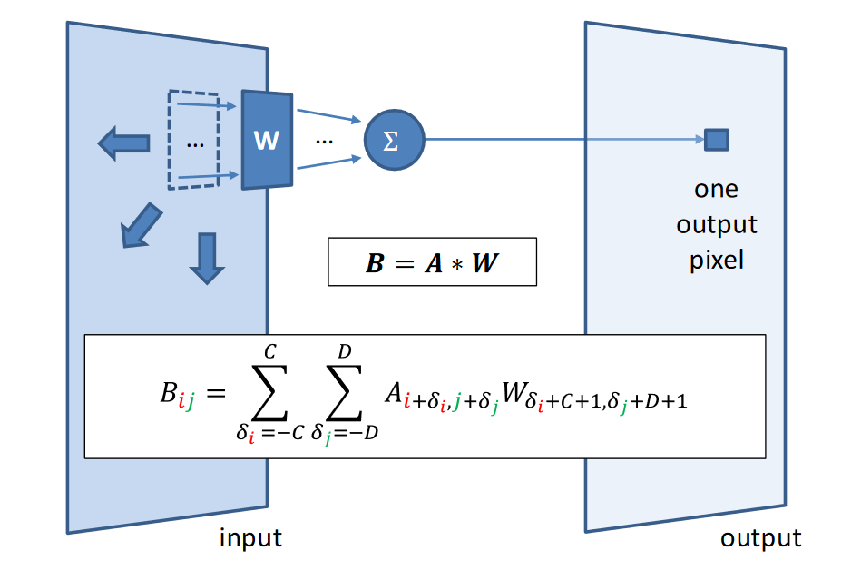
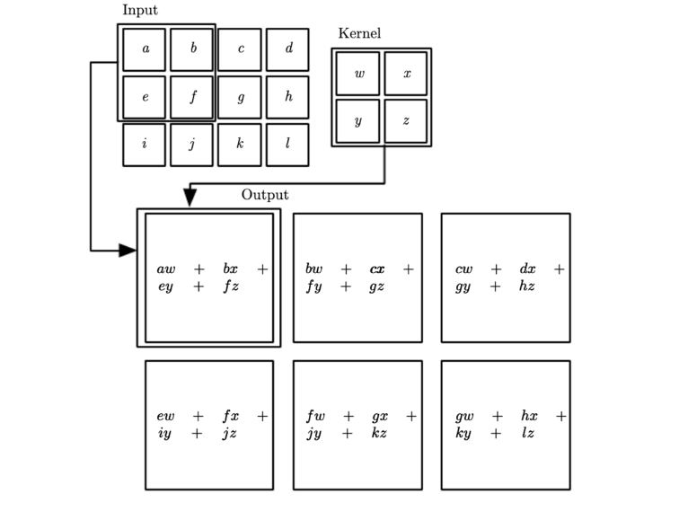
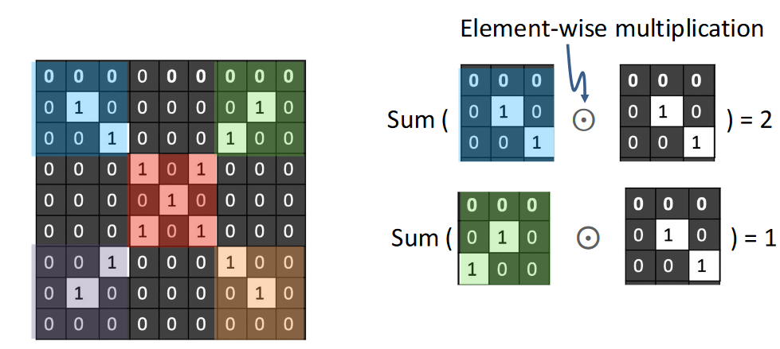
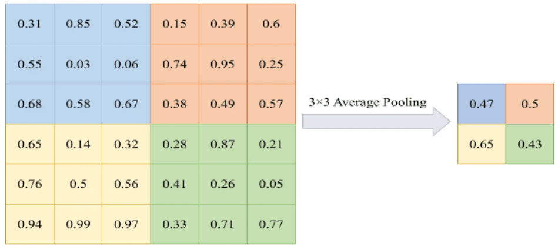
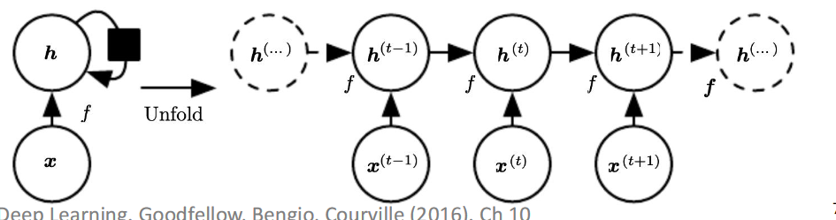

# Precepction and Artificial Neural Network

## Convolutional Neural Network

**Convolution**
Measures how the shape of one function matches the other as it **slides** along.

**Convolution on 2D images**

Using filter to perform element-wize multiplication

**Convolution filters (aka kernels)**

Filters/kernels can identify different patterns

- When input and kernel have the same patern: high activation response

**2D example**
Response map: 2D map of the presence of a pattern at different locations in an input

### Convolution parameters
Key *hyperparameters* in convolution
- Kernel size: size of the patches
- Number of filters: depth(channel) of the input
- Stride: how far to "slide" pacth across input
- Padding of input boundaries with zeros

parameter calculation:

Convolution layer: $\text{k height} \times \text{k width} \times \text{num of inputs} \times \text{num of kernels}$

Output: $\frac{\text{input}- \text{kernel} + \text{padding} \times 2 } {\text{stride}} + 1$

Maxpooling layer: Because the maxpooling extract the feature using functions like $\max$, it does not have parameters

Output: $\frac{\text{input size}- \text{pool size} + \text{padding} \times 2 }{stride} + 1$

### Components of a CNN
**Convolutional layers**
- Complex input representations based on convolution operation
- Filter weights are learned from training data

**Downsampling, usually via Max Pooling**
- Re-scales to smaller resolution, limits parameter explosion

**Fully connected parts and output layer**
- Merges representations together

**Downsampling via max pooling (re)**

Max pooling helps reduce the spatial dimensions (height and width) of the feature maps while keeping the most important information.

- Maxpooling takes an $m \times m$ patch (window) from the input feature map and selects the **maximum** value from that patch.

- Forward pass records maximising element, which is then used in the backward pass during back-propagation

**Convolution + Max Pooling Achieves Translation Invariance**

If the input image is shifted slightly, the network can still recognize the same feature

Consider shift input image:
- exact same kernels will activate, with same responses
- max-pooling over the kernel outputs gives same output
- size of max-pooling patch limits the extent of invariance

**Can include padding around input boundaries**

## Recurrent Neural Networks, Attention, and the Transformer

### Recurrent Netwoks
**Recurrent Neural Nets(RNNS)**
RNN creats networks dynamically, based on input sequence.
- Given sequence of inputs $x^{(1)},x^{(2)},\ldots,x^{(t)}$
- Process each symbol from left to right, to form a sequence of hidden state $h^{(t)}$
- Each $h^{(t)}$ encodes all inputs up to $t$

**Long Short-Term Memory**
- LSTM introduces state self-loop, based on copying
    - Takes copy of previous state, scales by sigmoid forget gate
- Gradient magnitude now maintained
    - Can handle 100+ distance phenimena (vs 5-19 for RNN)

### Transformers
RNNs over long sequences not to good at representing proprties of the full sequence

**Attention** averages over hidden sequence
- Avoids bottleneck, and uncovers meaningful stucture

**Self-Atention**
- **Transformers** use attention as means of representing sequences directly, instead of RNN.
