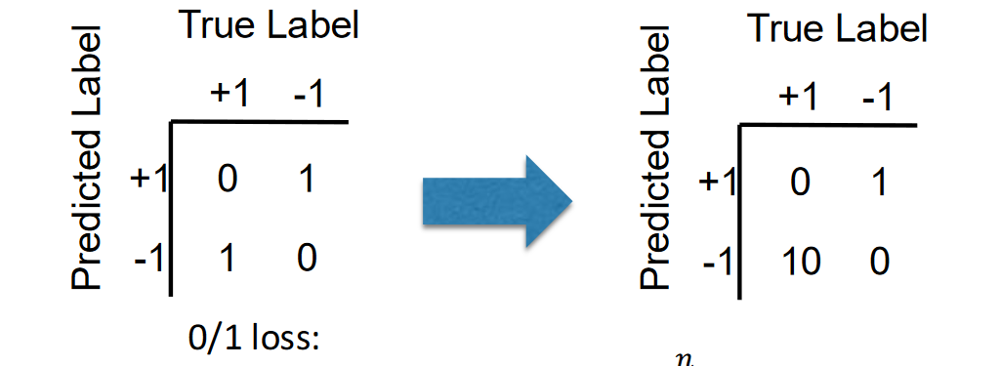
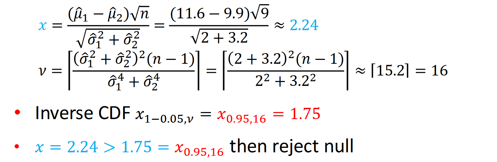

## Cross validation
Compare different algorithms in terms of performance from limited available data and help choose hyperparameters for an algorithm

**Performance matrices**
- Given a dataset $D = \{x_1, y_1, \ldots, x_n, y_n \}$ of n samples.
- For a data point $x_i$ we predict $g(x_i)$

Matrices in **regression**
- Mean squared error: $MSE(g) = \frac{1}{n} \sum_{i = 1}^{n}(g(x_i)-y_i)^2$
- Root mean squared error: $RMSE(g) = \sqrt{MSE(g)}$
- Mean absolute error: $\frac{1}{n}\sum_{i=1}^{n} |g(x_i)-y_i|$

Performance metrics in **classification**

|                | True Label +1 | True Label -1 |
|----------------|---------------|---------------|
| Predicted +1   | TP            | FP            |
| Predicted -1   | FN            | TN            |

- Accurcy: (𝑇𝑃 + 𝑇𝑁) / (𝑇𝑃 + 𝐹𝑃 + 𝐹𝑁 + 𝑇𝑁)
- Error: (𝐹𝑃 + 𝐹𝑁)/(𝑇𝑃 + 𝐹𝑃 + 𝐹𝑁 + 𝑇𝑁)
- Recall/Sensitivity: 𝑇𝑃/(𝑇𝑃 + 𝐹𝑁)
- Precision 𝑇𝑃/(𝑇𝑃 + 𝐹𝑃)
- Specificity 𝑇𝑁/(𝑇𝑁 + 𝐹𝑃)
- F1-score: 2 𝑃𝑟𝑒𝑐𝑖𝑠𝑖𝑜𝑛 × 𝑅𝑒𝑐𝑎𝑙𝑙/(𝑃𝑟𝑒𝑐𝑖𝑠𝑖𝑜𝑛 + 𝑅𝑒𝑐𝑎𝑙𝑙)

**Receiver Operating Characteristic (ROC)**

Summarized with an Area Under the Curve (AUC):
- Random: 0.5
- Perfect Classifier: 1

**Modified loss function**

Different misclassification have difference influence

Predicting a diseased patient as healthy has much worse serious consequences than predicting a diseased patient as healthy!!!

**Cross-validation: using “unseen” data**

Split datasets in three parts

| Training Set    | Validation Set         | Test Set     | 
|----------------|---------------|---------------|

**K-Fold Cross Validation**
- Split training data $D$ into $k$ **disjoint** sets $S_1, \ldots, S_k$
    - Either randomly, or in a fixed fashion
    - If $D$ has $n$ samples, then each fold has approximately $\frac{n}{k}$ samples
    - Popular choices: $k = 5, k = 10, k = n$ (leave one out)
- For $i = 1 \ldots k$
    - train with sets $S_1, \ldots, S_{i-1}, S_{i+1},\ldots, S_k$
    - test on set $S_i$
    - let $M_i$ be the test metric (e.g., accuracy, MSE)

Mean $\hat{u} = \sum_{i = 1}^{k}\quad$ variance $\hat{\sigma}^2 = \sum_{i = 1}^{k} (M_i - \hat{u})^2$

**0.632 Bootstrapping**

Let $B > 0$, and $n$ be the number of training samples in $D$

- For $i = 1 \ldots B$ :
    - Pick n samples from $D$ with **replacment**, call it $S_i$ ($S_i$ might contain the same sample more than once)
    - train with set $S_i$
    - test on the remaining samples $(D - S_i)$
    - let $M_i$ be the test metric (e.g., accuracy, MSE)

Mean $\hat{u} = \sum_{i = 1}^{B} M_i \quad$ variance $\hat{\sigma}^2 = \sum_{i = 1}^{k} (M_i - \hat{u})^2$

- not picking one particular item in 1 draw is 1 − 1/𝑛
- not picking one particular item in 𝑛 draws is $(1 − 1/𝑛)^2$  
- picking one particular item in 𝑛 draws is $1- (1 − 1/𝑛)^2$  

Finally: $\lim_{n\to\infty} 1-(1-1/n)^n = 1-1/e \approx 0.632$

**Nested Cross-valdation**
- Useful for hyperparameter tuning
- Inner cross-vaildation (e.g., 0.632 bootstapping) to try different hypermarameters
- Outer cross-validation (e.g., k-folds) to report metric using the best hyptermenter   

**Hypothesis testing**
- Let $\hat{u_1},\hat{u_2},\hat{\sigma_1}^2,\hat{\sigma_2}^2$ be mean and variance of algorithms 1 and 2

$$
\text{Let} \, x = \frac{(\hat{\mu}_1-\hat{\mu}_2)\sqrt{n}}{\sqrt{\hat{\sigma}_1^2+\hat{\sigma}_2^2}} \qquad \nu = \left\lfloor\frac{(\hat{\sigma}_1^2+\hat{\sigma}_2^2)^2(n-1)}{\hat{\sigma}_1^4+\hat{\sigma}_2^4}\right\rfloor

$$
v using **upper bound**, degrees of freedom of Student's t-distribution

Examples

## Learning with expert advice
In machine learning, the term "expert" typically refers to a model or algorithm with specialized knowledge or predictive ability for a specific task or domain.

**Learning from expert advice**
- Learner listens to some / all experts making decisions
- True outcomes are ADVERSARIAL
- Learner updates weights over experts based on their loses
- Algorithm all forms of "multiplicative weights"
- Nice clean bounds on total mistakes/losses: by "potential function" technique

**Adversarial**
- The real outcomes do not come from a fixed probability distribution, but rather may be chosen by an adversary attempting to make the learner fail. This is a conservative assumption that ensures the algorithm performs well even in worst-case scenarios. Under this setting, algorithms need to be adversarial, capable of handling the most unfavorable situations.
**potential function and clean upper bound**
Using potential functions, we can derive **explicit upper bounds** on the algorithm's cumulative number of mistakes or total loss.

**Infallible expert(one always perfect)**
- Majority Vote Algorithm

**Imperfect experts(none guaranteed perfect)-incresingly better**
- Weighted Majority Vote Algorithm by Halving
- Weighted Majority Voting by General Multiplicative Weights
- Probabilistic Experts Algorithm

### Infallible Expert Algorithm: Majority Vote
1. Initialzie set of experts who haven't **made any mistakes**
2. Repeat per round
    - Observe perdictions E_i for all $i \in \{1, \ldots, n\}$
    - Make *majority prediction* $\argmax_{y \in \{-1,1\}} \sum_{i \in E} 1[E_i = y]$
    - Overve correct outcome
    - *Remove mistaken experts* from E

**Mistake bound for Majority Vote**
Under infallible expert assumption, majiroty vote makes total misktakes $M \leq \log_2 n$

### Imperfect experts and the Halving Algorithm
No more guarantee of an infallible expert

“Zero tolerance” dropping experts on a mistake is **No sense**

**Imperfect experts: Halving Algorithm**
1. Initialize $w_i = 1$ weight of expert $E_i$
2. Repeat per round
    - Observe predicitions $E_i$ for all $i \in \{1, \ldots, n\}$
    - Make *weighted majority prediction* $\argmax_{y \in \{-1,1\}} \sum_{i \in E} w_i 1[E_i = y]$
    - Oberve correct outcome
    - Downweigh each mistaken expert $E_i \quad w_i \leftarrow w_i / 2$

**Mistake bound for Halving**\
If the best expert makes m mistakes, then weighted majority vote makes $M \leq 2.4(m + \log_2 n)$ mistakes

### From Halving to Multiply weights by $1- \epsilon$
1. Initialize $w_i = 1$ weight of expert $E_i$
2. Repeat per round
    - Observe predicitions $E_i$ for all $i \in \{1, \ldots, n\}$
    - Make *weighted majority prediction* $\argmax_{y \in \{-1,1\}} \sum_{i \in E} w_i 1[E_i = y]$
    - Oberve correct outcome
    - Downweigh each mistaken expert $E_i \quad w_i \leftarrow w_i (1- \epsilon)$

**Mistaken bound for $1- \epsilon$**\
If the best expert makes $m$ mistakes, then $1-\epsilon$ weighted majority vote makes $M \leq 2(1+ \epsilon)m + (2\log_e n) /\epsilon$ mistakes

**Mini Conclusion**

In the case of imperfect experts, the number of mistakes made by the weighted majority algorithm depends on the number of mistakes made by the best expert 𝑚, and the coefficient 2 in this dependency relationship is unavoidable.

### The probabilistic experts algorithm
- Change 1: change from mistakes to loss: $\text{Loss} \ell_i^{(t)} \in [0,1]$ of $E_i$
- Change 2: Randomised algorithm means, bounding **expected losses** (It is a risk!)

1. Initialize $w_i = 1$ weight of expert $E_i$
2. Repeat per round
    - Oberve predicitons $E_i$ for all $i \in \{1, \ldots, n\}$
    - Predict $E_i$ of expert *i with probability $\frac{w_i}{W}$* where $W = \sum_{j=1}^{n} w_j$
    - Observe *losses*
    - Update each weight $w_i \leftarrow (1-\epsilon)^{\ell_i^{(t)}} w_i$

**Expected loss bound**\
Expected loss of probalistic expert alghorithm is $L \leq \frac{\log n }{\epsilon} + (1 + \epsilon)L^*$ where $L^*$ is the minimum loss over experts

## MAB
Where we learn to take actions; we receive only indirect supervision in the form of rewards

**Multi-Armed Bandit**
- Simplest setting for balancing exploration, exploitation
- Same familiy of ML tasks as reinforcement learning

### Stochastic MAB setting
Possible actions $\{ 1,\ldots, k \}$ called "arms"
- Arm i has distributon $Pi$ on bounded rewards with mean $\mu_i$

In round $t = 1, \ldots, T$:
- Play action $i_t \in \{1, \ldots, k\}$
- Receive reward $R_{i_t}(t) \sim p_{i_t}$

Goal: minimize cumlative regret
- $u^*  T -  \sum_{t=1}^{T} E[R_{i_t}(t)]$
where $u^* = \max_i u_i$

### Greedy
At round t,
- Estimate value of each arm i as average reward observed 
$$
Q_{t-1}(i) = 
\begin{cases} 
\frac{\sum_{s=1}^{t-1} R_i(s) \mathbb{1}[i_s = i]}{\sum_{s=1}^{t-1} \mathbb{1}[i_s = i]}, & \text{if } \sum_{s=1}^{t-1} \mathbb{1}[I_s = i] > 0 \\ 
Q_0, & \text{otherwise}
\end{cases}

$$
**Some init constant $Q_0(i) = Q_0$ used until arm i has been puolled**

Eploit! $i_t \in \argmax_{1\leq i \leq k} Q_{t-1}(i)$

### $\epsilon$ - Greedy
At round t 
- Estimate value of each arm $i$ as average reward observed (Q- value function is same as greedy)
$$
Q_{t-1}(i) = 
\begin{cases} 
\frac{\sum_{s=1}^{t-1} R_i(s) \mathbb{1}[i_s = i]}{\sum_{s=1}^{t-1} \mathbb{1}[i_s = i]}, & \text{if } \sum_{s=1}^{t-1} \mathbb{1}[I_s = i] > 0 \\ 
Q_0, & \text{otherwise}
\end{cases}
$$

Exloit:
$$
i_t \sim 
\begin{cases} 
\arg \max_{1 \leq i \leq k} Q_{t-1}(i), & \text{with probability } 1 - \epsilon \\ 
\text{Unif}(\{1, \ldots, k\}), & \text{with probability } \epsilon 
\end{cases}

$$

$\epsilon$ controls exploration vs. exploitation
- Larger $\epsilon$ will increase the change to exploration
- Smaller $\epsilon$ will tend to choose exploitation

### Upper-Confidence Bound (UCB)
$$
Q_{t-1}(i) = 
\begin{cases} 
\hat{\mu}_{t-1}(i) + \sqrt{\frac{2 \log(t)}{N_{t-1}(i)}}, & \text{if } \sum_{s=1}^{t-1} \mathbb{1}[I_s = i] > 0 \\ 
Q_0, & \text{otherwise}
\end{cases}
$$

**Some init constant $Q_0(i) = Q_0$ used until arm i has been puolled**

$$
N_{t-1}(i) = \sum_{s=1}^{t-1} \mathbb{1}[I_s = i] \quad \hat{\mu}_{t-1}(i) = \frac{\sum_{s=1}^{t-1} R_i(s) \mathbb{1}[I_s = i]}{\sum_{s=1}^{t-1} \mathbb{1}[I_s = i]}
$$

