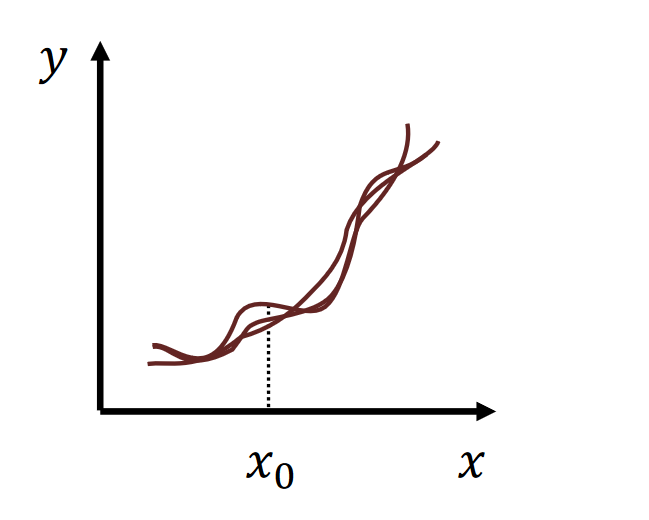
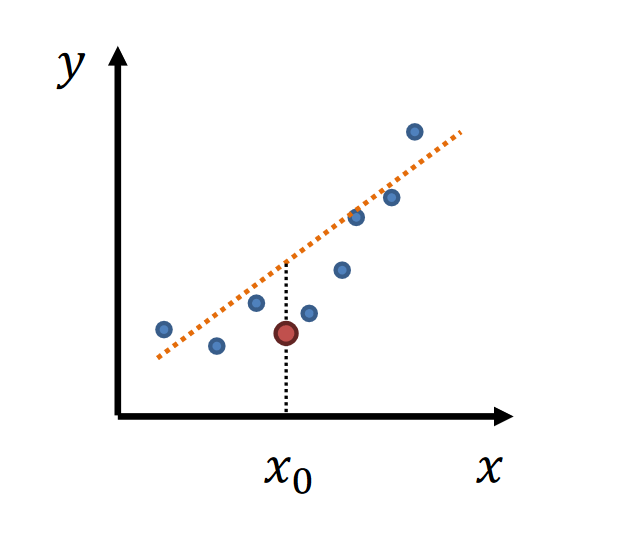
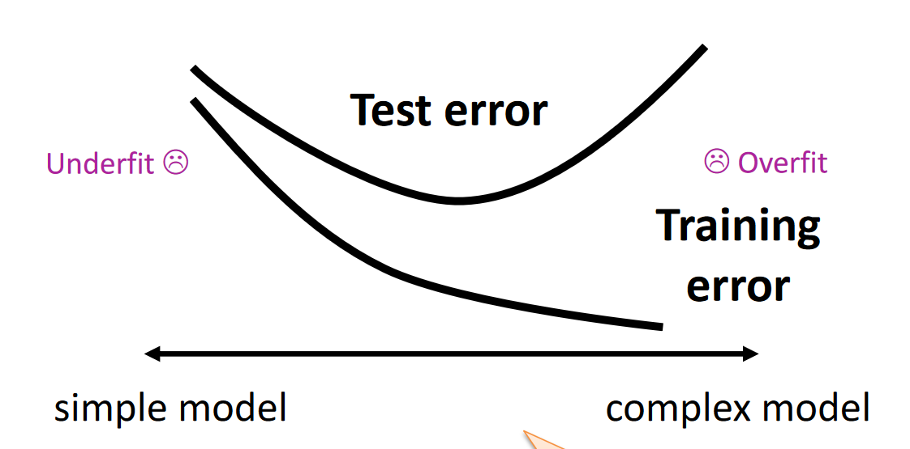

## Bias-variance trade-off
- **simple** model $\rightarrow$ low variance, high bias
- **complex** model $\rightarrow$ high variance, low bias

|  |  |
|:--------------------------:|:--------------------------:|
| high variance | high bias |

**Testing and trainning error**
    

## Empirical Risk and True Risk
**The true risk** is the expected value of the loss 𝑙

$$
R[f] = \mathbb{E}[l(Y, f(X))] = \int l(Y, f(X)) P(X, Y) dX dY
$$
- $l(Y, f(X))$: Loss function
- $P(X,y)$ joint distribution of input X and target Y

The **empirical risk** is an estimate (an average of a finite number of samples 𝑛) of the expected value
- sample size $\rightarrow \infty$, the true risk is the empirical risk

**Structural Risk Minimisation**

$$
\hat{R}_D[\hat{f}_D] + \sqrt{\frac{\log |\mathcal{F}| + \log(1/\delta)}{2n}}
$$

## VC dimension
$\mathcal{F} \ \textbf{shatters} \ \{ x_1, x_2 \}$ ： Possible Labelings
1. (0, 0)
2. (0, 1)
3. (1, 0)
4. (1, 1)

If 1 of the 4 labels missing,  $\mathcal{F} \ \textbf{does not shatter} \ \{ x_1, x_2 \}$ 

The **number** of maximun shattering sets = $VC(\mathcal{F})$

if $\mathcal{F}$ shatters $\{x_1, x_2, x_3\}$ and unique rows: $2^3 = 8$, $VC(\mathcal{F}) = 3$

**Sauer-Shelah Lemma**
The Upper bound of growth function $S_\mathcal{F}(n)$ given finite $VC(\mathcal{F})$:

$$
S_\mathcal{F}(n) \leq \sum_{i=0}^{VC(\mathcal{F})} \binom{n}{i}
$$
Since $\sum_{i=0}^{k} \binom{n}{i} \leq (n+1)^{k}$, the above implies:

$$
\log S_\mathcal{F}(n) \leq VC(\mathcal{F}) \log(n+1)
$$

**Structural Risk Minimisation(VC)(VC Generalisation Theorem)**

$$
\hat{R}_D[\hat{f}_D] + \sqrt{8\frac{VC(\mathcal{F})\log(2n + 1) + \log(4/\delta)}{n}}
$$

