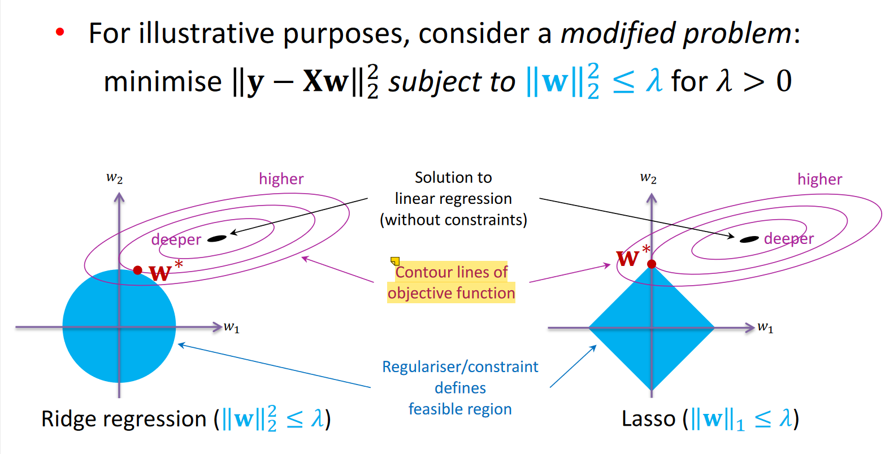

## Linear Regression
Model:  $H = a + bT$

- Criterion: minimise the sum of squared errors

Expressed as matrix form:
$$
y = X\beta + \epsilon

$$
where $\epsilon \sim \mathcal{N}(0, \sigma^2)$\
thus $y \sim \mathcal{N}(x'w , \epsilon)$

**Maximum-likelihood estimation**: Choose parameter values that maximise the probability of observed data
$$
p(y_1, ..., y_n|x_1, ..., x_n) = \prod_{i=1}^n p(y_i|x_i)
$$

Maximising log-likelihood as a function of 𝒘 is equivalent to minimising the sum of squared errors

$$
L = y'y - 2y'Xw + wX'Xw
$$

Solving for 𝒘 yields:
$$
\hat{w} = (X^T X)^{-1} X^T y
$$
$𝑿'$ denotes transpose\
$X'X$ should be an invertible matrix, that is: **a full rank matrix**, column vectorsw linear independence

**Basis expansion for linear regression**: Turn linear regression to polynomial regression for better fit the data

## Logistic regression
Logistic regression assumes a **Bernoulli distribution** with parameter\
and is a model for solving **binary classification problems**
$$
P(Y=1|\mathbf{x}) = \frac{1}{1 + \exp(-\mathbf{x}'w)}
$$

MLE for Logistic regression cannot get an **analytical solution**.

We introduce: Approximate iterative solution
- Stochastic Gradient Descent (SGD)
- Newton-Raphson Method

### Stochastic Gradient Descent (SGD)

### Newton-Raphson Method

## Regularization
Normal equations solution of linear regression:
$$
\hat{w} = (X^T X)^{-1} X^T y
$$
With irrelevant/multicolinear features, matrix 𝐗!𝐗 has **no inverse**
**Regularisation**: introduce an additional condition into the system

$$
\|y - Xw\|_2^2 + \lambda\|w\|_2^2 \text{ for } \lambda > 0
$$
<>
  Adds λ to eigenvalues of 𝐗'𝐗: makes invertible : {' '}
  ridge regression
</>

Lasso (L1 regularisation) encourages solutions to sit on the axes\
Some of the weights are set to zero $\rightarrow$ **Solution is sparse**