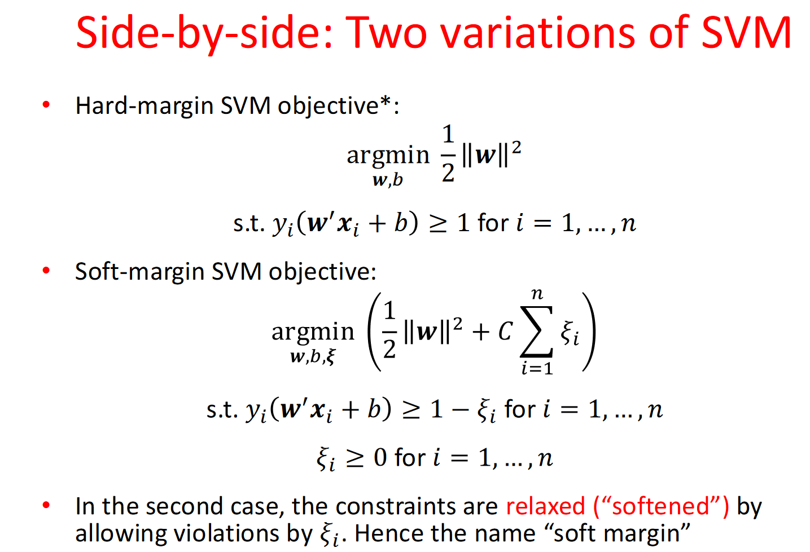

# Support Vector Machine
An SVM is a linear binary classifier: choosing parameters means choosing a separating boundary (hyperplane).

SVMs aim to find the separation boundary that **maximises the margin** between the classes.

A hyperplane is a decision boundary that differentiates the two classes in SVM.
- Hyperplane: a hyperplane is a flat hypersurface, a subspace whose dimension is one less than that of the ambient space.

The hyperplane of the decision boundary in $\mathbb{R}^m$ is defined as
$$
\mathbf{w}^T \mathbf{x} + b = 0
$$
- $\mathbf{w}$: a normal vector perpendicular to the hyperplane
- $b$ : the bias term

The distance from the 𝑖-th point to a perfect boundary is
$$
\|r_i\| = \frac{y_i(\mathbf{w}^{'} \mathbf{x}_i + b)}{\|\mathbf{w}\|}
$$

- The margin width is the distance to the closest point

### Hard-margin SVM objective

SVMs aim to find:
$$
\arg \min_{\mathbf{w}, b} \frac{1}{2}\|\mathbf{w}\|^2
$$
- factor of $\frac{1}{2}$ is for mathematical convenience

Subject to constraints:
$$
y_i(\mathbf{w}' \mathbf{x}_i + b) \geq 1 \text{ for } i = 1, \ldots, n
$$

### Soft-margin SVM

- Soft-margin SVM objective:
$$

\argmin_{\mathbf{w}, b, \xi} \frac{1}{2} \|\mathbf{w}\|^2 + C \sum_{i=1}^{n} \xi_i
$$
- $\xi_i$: slack variable

Subject to constraints:
$$
\xi_i \geq 1 - y_i (w'x_i + b) \text{ for } i = 1, \ldots, n \\[6pt]
\xi_i \geq 0 \text{ for } i = 1, \ldots, n
$$

## Kernel Methods
The primal problem of SVM is a convex optimaztion problem. We can utilize Lagrangian and Duality to solve the problem in a more easy way.

**Lagrangian multipliers**: 
- Transform to **unconstrained optimisation**
- Transform **primal program** to a related **dual program**, alternate to primal
- Analyse necessary & sufficient conditions for solutions of both programs

**primal program** :  $min_x max_{\lambda \geq 0, v}\mathcal{L}(x,\lambda, v)$\
**dual program** : $max_{\lambda \geq 0, v} min_x \mathcal{L}(x,\lambda, v) \quad$ (Easier to compute!)

**Karush-Kuhn-Tucker Necessary Conditions**
- **Primal feasibility** : $g_i(x) \leq 0$ and $h_j(x_i) = 0$. The solution $x^*$ must satisfy the primal consrtraints.
- **Dual feasibility** : $\lambda \geq 0$ for $i = 1, \ldots ,n$. The Lagrange multiplier $\lambda_{i}^{*}$ must be non-negative
- **Complementary slackness** : $\lambda_{i}^{*} g_i(x^{*}) = 0 \text{, for } i = 1, \ldots, n$. For any inequality constriant, the product of the Lagrange multiplier and the constraint function must be zero.
- **Stionary** : $\nabla_x \mathcal{L}(x^*, \lambda^*, \nu^*) = 0$. The gradient of the Lagrangian with respect to x must be zero at the optimal solution

### Hard-margin SVM with The Lagrangian and duality
$$
\mathcal{L}(\mathbf{w}, b, \boldsymbol{\lambda}) = \frac{1}{2}\mathbf{w}'\mathbf{w} + \sum_{i=1}^n \lambda_i - \sum_{i=1}^n \lambda_i y_i \mathbf{x}_i'\mathbf{w} - \sum_{i=1}^n \lambda_i y_i b
$$
Applying the staionary contion in KKT:
$$
\frac{\partial \mathcal{L}}{\partial b} = -\sum_{i=1}^n \lambda_i y_i = 0 \rightarrow \text{New constraint, Eliminates primal variable } b \\[6pt]
\nabla_{\mathbf{w}}\mathcal{L} = \mathbf{w}^* - \sum_{i=1}^n \lambda_i y_i \mathbf{x}_i = 0 \rightarrow \text{Eliminates primal variable } \mathbf{w}^* = \sum_{i=1}^n \lambda_i y_i \mathbf{x}_i
$$
Then we make the problem moew easier! Here is:

**Dual program for hard-margin SVM**
$$
\underset{\lambda}{\text{argmax}} \sum_{i=1}^n \lambda_i - \frac{1}{2}\sum_{i=1}^n\sum_{j=1}^n \lambda_i\lambda_j y_i y_j \mathbf{x}_i^{\prime}\mathbf{x}_j \\[6pt]

\text{s.t.} \; \lambda_i \geq 0 \text{ and } \sum_{i=1}^n \lambda_i y_i = 0
$$

**Making predictions with dual solution**
$$
s = b^* + \sum_{i=1}^{n} \lambda_{i}^{*} y_i x'_{i}x
$$

For lagrangian problem: 
If $\lambda_i = 0$ : The sample  $x_i$ is does not impact the decision boundary.

For lagrangian problem in **soft-margin SVM** the slack variable $\xi$:
- if $\xi < 0$, which is theoretically impossible, as $\xi$ represent the deviation from the margin and is defined to be non-negative, i.e., $\xi \geq 0$
- $\xi = 0$ : The variable is correctly classified and lies either outside the margin or exactly on the margin boundary.
- $0 < \xi < 1$ : The sample lies **within the margin** but is still correctly classified.
- $1 < \xi < 2$ : The sample is misclassified, but the distance to the hyperplane does not exceed the opponent's margin.
- $\xi \geq 2$ : The sample is severely misclassified and is more than one margin width away from the hyperplane.

### Soft-margin SVM’s dual
The function for Sofr-Margin is similar. The difference is the constraint of $\lambda$
$$
\underset{\lambda}{\text{argmax}} \sum_{i=1}^n \lambda_i - \frac{1}{2}\sum_{i=1}^n\sum_{j=1}^n \lambda_i\lambda_j y_i y_j \mathbf{x}_i^{\prime}\mathbf{x}_j \\[6pt]
\text{s.t. } C \geq \lambda_i \geq 0 \text{ and } \sum_{i=1}^n \lambda_i y_i = 0
$$

### Kernelising the SVM
A stragety for **Feature space transformation**
- Map data into a new feature space
- Run hard-margin or soft-margin SVM in new space
- Decision boundary is non-linear in original space

$x_i' x_j \rightarrow \phi(x_i)' \phi(x_j)$

**Polynomial kernel**
$$
k(u,v) = (u'v + c)^d
$$

**Radial basis function kernel**
$$
k(u,v) = \exp(- \gamma \|u-v \|^2)
$$

### Kernel trick

In machine learning, the **kernel trick** allows us to compute the inner product in a high-dimensional feature space without explicitly mapping data points to that space.

For two data points $x_i$ and $x_j$ : 
$$
x_i = \begin{bmatrix} x_{i1} \\ x_{i2} \end{bmatrix}, \quad x_j = \begin{bmatrix} x_{j1} \\ x_{j2} \end{bmatrix}
$$
The polynomial kernel function defines an inner product in the original space as:
$$
K(x_i, x_j) = (x_i \cdot x_j + 1)^2
$$
Expanding the polynomial:
$$
K(x_i, x_j) = (x_{i1} x_{j1} + x_{i2} x_{j2} + 1)^2 = x_{i1}^2 x_{j1}^2 + x_{i2}^2 x_{j2}^2 + 2x_{i1} x_{j1} x_{i2} x_{j2} + 2x_{i1} x_{j1} + 2x_{i2} x_{j2} + 1
$$
This result is equivalent to the inner product in a higher-dimensional space without explicitly computing the high-dimensional mapping.